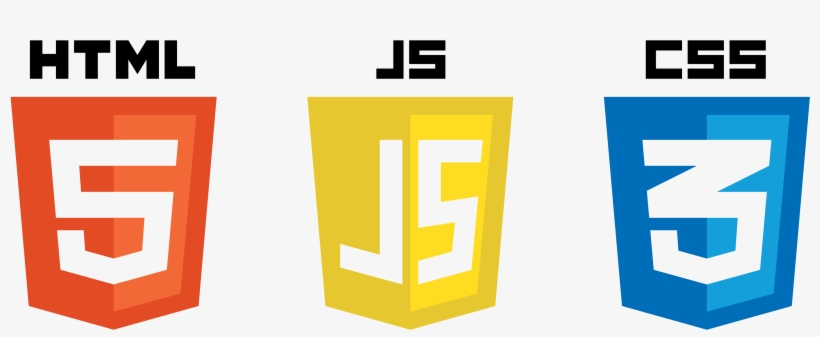

<pre>

  

</pre>

### Designing a generic games console as a project for GeeksHubsAcademy
> As a linux fan, I used Ubuntu to work on the project.

> I've coded it in <b>HTML, CSS and a bit of JAVASCRIPT</b> (on/off sound)  

> All buttons have different visual effects, only having sound in the "on/off/reset" when clicked <b>and</b>, I also added the logo on the screen to make it dynamic.  

> I've deployed this project in Github Pages so that anyone can see the finished "product" and left some comments inside the code to make it easier for anyone who wants to see how I've written it 👍👍👍

> The requirements for this project were to make a console controller, but <b>I decided to go a step further</b> and create the whole game console.

> 
---
> Here is a capture of the finished project;

---
> I hope you enjoy the shades, movement and sound as much as I enjoyed creating it!
